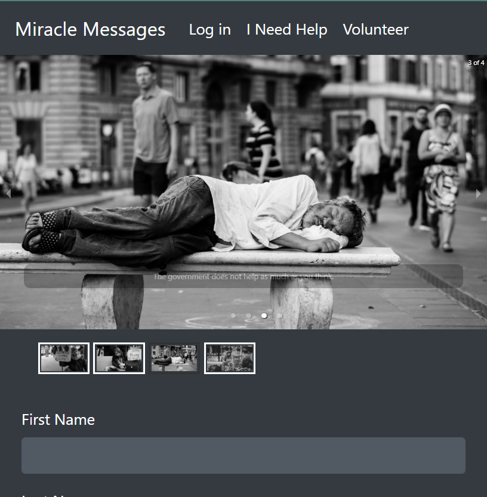

# Miracle Messages Map v1.0.0

[View Interactive Miracle Messages Map API Docs](https://mmm-api-docs.netlify.com/)

- [Homeless](#homeless)
	- [DELETE /api/homeless/:id](#delete-/api/homeless/:id)
	- [PUT /api/homeless/:id](#put-/api/homeless/:id)
	- [GET /api/homeless](#get-/api/homeless)
	- [GET /api/homeless/:id](#get-/api/homeless/:id)
	- [POST /api/homeless](#post-/api/homeless)
	
- [Partners](#partners)
	- [DELETE /api/partners/:id](#delete-/api/partners/:id)
	- [PUT /api/partners/:id](#put-/api/partners/:id)
	- [GET /api/partners](#get-/api/partners)
	- [GET /api/partners/:id](#get-/api/partners/:id)
	- [POST /api/auth/login](#post-/api/auth/login)
	- [POST /api/auth/register](#post-/api/auth/register)
	


# Homeless

## DELETE /api/homeless/:id


	DELETE /api/homeless/:id


### Parameters

| Name    | Type      | Description                          |
|---------|-----------|--------------------------------------|
| id			| id			|  <p>User Id (comes from URL)</p>							|

### Examples

Request

```
axios.delete('/api/homeless/:id');
```

### Success Response

Response

```
HTTP/1.1 204 No Content
```
## PUT /api/homeless/:id


	PUT /api/homeless/:id


### Parameters

| Name    | Type      | Description                          |
|---------|-----------|--------------------------------------|
| id			| id			|  <p>Required User Id (comes from URL)</p>							|
| name			| string			| **optional** <p>Optional updated Homeless Name</p>							|
| email			| string			| **optional** <p>Optional updated Homeless Email</p>							|
| city			| string			| **optional** <p>Optional updated Homeless City</p>							|
| state			| string			| **optional** <p>Optional updated Homeless State</p>							|
| country			| string			| **optional** <p>Optional updated Homeless Country</p>							|
| longitude			| float			| **optional** <p>Optional updated Homeless Longitude</p>							|
| latitude			| float			| **optional** <p>Optional updated Homeless Latitude</p>							|

### Examples

Request

```
axios.put('/api/homeless/:id', updatedHomeless);
```

### Success Response

Response

```
{
      "id": 2,
      "firstName": "Joel",
      "lastName": "Perez",
      "city": "Lafayette",
      "state": "CO",
      "zip": null,
      "country": "United States of America",
      "created": 1564524174115,
      "longitude": -105.097455,
      "latitude": 39.994962
  } *
```
## GET /api/homeless


	GET /api/homeless

### Headers

| Name    | Type      | Description                          |
|---------|-----------|--------------------------------------|
| token			| string			|  <p>Token returned from login passed in as req.headers.authorization</p>							|

### Examples

Request

```
axios.get('/api/homeless');
```

### Success Response

Response

```
[
       {
           "id": 14,
           "firstName": "McClure",
           "lastName": "Daley",
           "longitude": -121.806,
           "latitude": 38.0049
       },
       {
           "id": 15,
           "firstName": "Edmondson",
           "lastName": "Africa",
           "longitude": -122.198,
           "latitude": 37.4613
       }
   ]
```
## GET /api/homeless/:id


	GET /api/homeless/:id

### Headers

| Name    | Type      | Description                          |
|---------|-----------|--------------------------------------|
| token			| string			|  <p>Token returned from login passed in as req.headers.authorization</p>							|

### Parameters

| Name    | Type      | Description                          |
|---------|-----------|--------------------------------------|
| id			| id			|  <p>User Id (comes from URL)</p>							|

### Examples

Request

```
axios.get('/api/homeless/:id');
```

### Success Response

Response

```
{
      "id": 2,
      "firstName": "Joel",
      "lastName": "Perez",
      "city": "Lafayette",
      "state": "CO",
      "zip": null,
      "country": "United States of America",
      "created": 1564524174115,
      "longitude": -105.097455,
      "latitude": 39.994962
  }
```
## POST /api/homeless


	POST /api/homeless


### Parameters

| Name    | Type      | Description                          |
|---------|-----------|--------------------------------------|
| firstName			| string			|  <p>Mandatory First Name</p>							|
| lastName			| string			|  <p>Mandatory Last Name</p>							|
| city			| string			| **optional** <p>Optional city</p>							|
| state			| string			| **optional** <p>Optional state</p>							|
| zip			| string			| **optional** <p>Optional zip code</p>							|
| country			| string			| **optional** <p>Optional country</p>							|
| longitude			| float			| **optional** <p>Optional longitude</p>							|
| latitude			| float			| **optional** <p>Optional latitude</p>							|

### Examples

Request

```
axios.post('/api/homeless', newHomelessPerson);
```

### Success Response

Response

```
{
      "id": 2,
      "firstName": "Joel",
      "lastName": "Perez",
      "city": "Lafayette",
      "state": "CO",
      "zip": null,
      "country": "United States of America",
      "created": 1564524174115,
      "longitude": -105.097455,
      "latitude": 39.994962
  }
```
# Partners

## DELETE /api/partners/:id


	DELETE /api/partners/:id


### Parameters

| Name    | Type      | Description                          |
|---------|-----------|--------------------------------------|
| id			| id			|  <p>User Id (comes from URL)</p>							|

### Examples

Request

```
axios.delete('/api/partners/:id');
```

### Success Response

Response

```
HTTP/1.1 204 No Content
```
## PUT /api/partners/:id


	PUT /api/partners/:id


### Parameters

| Name    | Type      | Description                          |
|---------|-----------|--------------------------------------|
| id			| id			|  <p>Required User Id (comes from URL)</p>							|
| name			| string			| **optional** <p>Optional updated Partner Name</p>							|
| email			| string			| **optional** <p>Optional updated Partner Email</p>							|
| city			| string			| **optional** <p>Optional updated Partner City</p>							|
| state			| string			| **optional** <p>Optional updated Partner State</p>							|
| country			| string			| **optional** <p>Optional updated Partner Country</p>							|
| longitude			| float			| **optional** <p>Optional updated Partner Longitude</p>							|
| latitude			| float			| **optional** <p>Optional updated Partner Latitude</p>							|

### Examples

Request

```
axios.put('/api/partners/:id', updatedPartner);
```

### Success Response

Response

```
{
    "id": 447,
    "name": "Joels food bank",
    "email": "yeahright@noway.com",
    "city": "Denver",
    "state": "CO",
    "country": "USA",
    "longitude": -104.988415,
    "latitude": 39.749885,
    "password": "$2a$10$l1AbQFAGX.CZOEQm1RgaP.qVstDpteUXm2XuqhT9q280KMnQDQYxi"
}
```
## GET /api/partners


	GET /api/partners


### Examples

Request

```
axios.get('/api/partners');
```

### Success Response

Response

```
[
   {
           "id": 1,
           "name": "Nicole Zaborsky",
           "email": "nicolezaborsky@charter.net",
           "longitude": -119.9843482,
           "latitude": 38.9332411
      },
      {
           "id": 2,
           "name": "Jill Baker",
           "email": "jlbaker@nnva.gov",
           "longitude": -76.4321089,
           "latitude": 36.9786449
       }
   ]
```
## GET /api/partners/:id


	GET /api/partners/:id


### Parameters

| Name    | Type      | Description                          |
|---------|-----------|--------------------------------------|
| id			| id			|  <p>User Id (comes from URL)</p>							|

### Examples

Request

```
axios.get('/api/partners/:id');
```

### Success Response

Response

```
{
    "id": 447,
    "name": "Joels food bank",
    "email": "yeahright@noway.com",
    "city": "Denver",
    "state": "CO",
    "country": "USA",
    "longitude": -104.988415,
    "latitude": 39.749885,
    "password": "$2a$10$l1AbQFAGX.CZOEQm1RgaP.qVstDpteUXm2XuqhT9q280KMnQDQYxi"
  }
```
## POST /api/auth/login


	POST /api/auth/login


### Parameters

| Name    | Type      | Description                          |
|---------|-----------|--------------------------------------|
| email			| string			|  <p>Mandatory email</p>							|
| password			| string			|  <p>Mandatory password</p>							|

### Examples

Request

```
axios.post('/api/auth/login');
```

### Success Response

Response

```
{
    "id": 447,
    "name": "Joels food bank",
    "email": "yeahright@noway.com",
    "city": "Denver",
    "state": "CO",
    "country": "USA",
    "longitude": -104.988415,
    "latitude": 39.749885,
    "password": "$2a$10$l1AbQFAGX.CZOEQm1RgaP.qVstDpteUXm2XuqhT9q280KMnQDQYxi"
  }
```
## POST /api/auth/register


	POST /api/auth/register


### Parameters

| Name    | Type      | Description                          |
|---------|-----------|--------------------------------------|
| name			| string			| **optional** <p>Optional name</p>							|
| email			| string			|  <p>Mandatory email</p>							|
| password			| string			|  <p>Mandatory password</p>							|
| city			| string			| **optional** <p>Optional city</p>							|
| state			| string			| **optional** <p>Optional state</p>							|
| country			| string			| **optional** <p>Optional country</p>							|
| longitude			| float			| **optional** <p>Optional longitude</p>							|
| latitude			| float			| **optional** <p>Optional latitude</p>							|

### Examples

Request

```
axios.post('/api/auth/register');
```

### Success Response

Response

```
{
    "id": 447,
    "name": "Joels food bank",
    "email": "yeahright@noway.com",
    "city": "Denver",
    "state": "CO",
    "country": "USA",
    "longitude": -104.988415,
    "latitude": 39.749885,
    "password": "$2a$10$l1AbQFAGX.CZOEQm1RgaP.qVstDpteUXm2XuqhT9q280KMnQDQYxi"
  }
```

Site working at: https://miraclemessages.netlify.com


